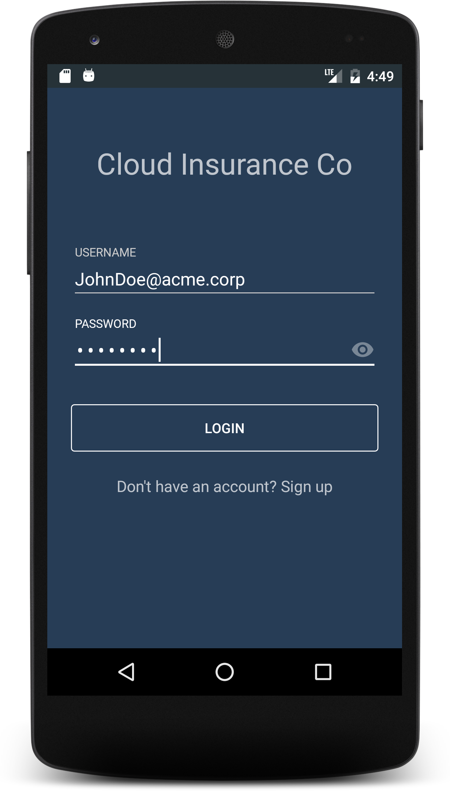
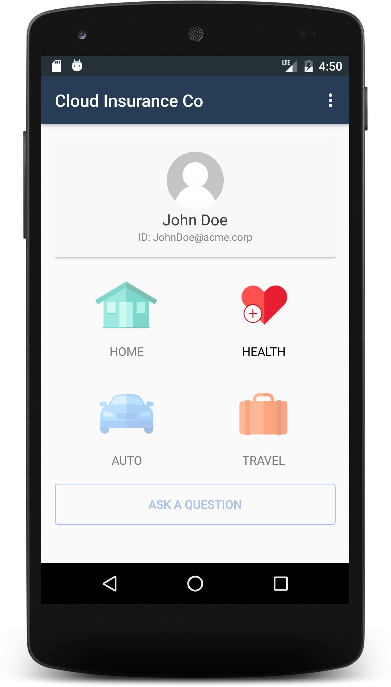
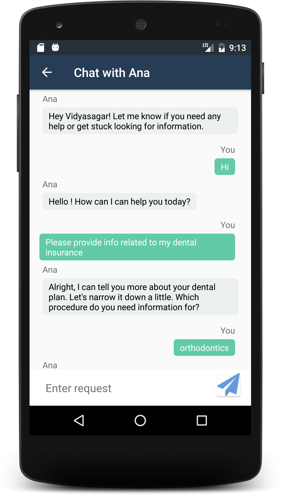

# Cloud Insurance Co. - Android client


This service is part of the larger [Cloud Insurance Co.](https://github.com/IBM-Bluemix/cloudco-insurance) project.

# Overview

A native android app to interact with the chat bot integrated in the [Cloud Insurance Co.](https://github.com/IBM-Bluemix/cloudco-insurance) application.





## Application Requirements

* Android Studio 2.2.1 and above, Android 6.0 and Above (API Level 23+)
* Gradle

## Running the application with the Android emulator

1. The android app depends on the [Cloud Insurance Bot app](https://github.com/IBM-Bluemix/insurance-bot). Make sure to deploy this app first. The simpler path to deploy this app is to use the [Cloud Insurance toolchain](https://github.com/IBM-Bluemix/insurance-toolchain).

1. Ensure Gradle is properly setup in your environment.

1. Clone the app to your local environment from your terminal using the following command:

  ```
  git clone https://github.com/IBM-Bluemix/insurance-bot-android.git
  ```

  * or Download and extract the source code from [this archive](https://github.com/IBM-Bluemix/insurance-bot-android/archive/master.zip)

1. Change to the checkout directory

  ```
  cd insurance-bot-android
  ```

1. Launch Android Studio and Select "Open an existing Android Studio Project". Navigate to insurance-bot-android folder and Click OK.

1. Edit `/app/src/main/res/values/config.xml` and replace the `hosted_url` property with the location where you deployed the `insurance-bot` app.

1. Allow Gradle Sync and build to complete

1. Run the app

## License

See [License.txt](License.txt) for license information.
